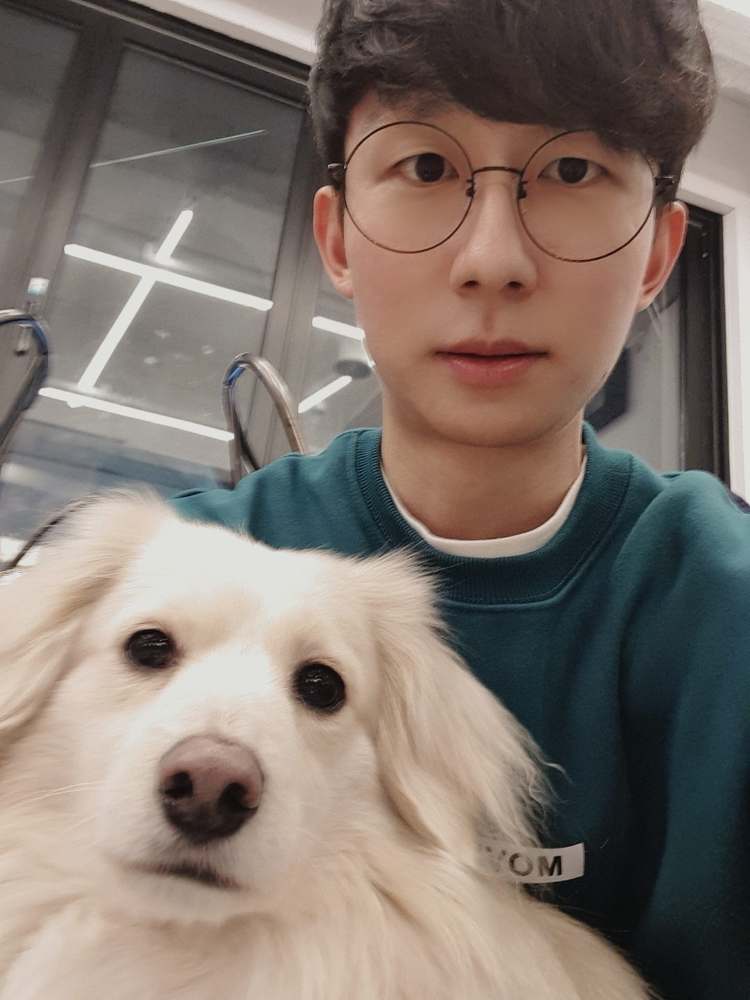
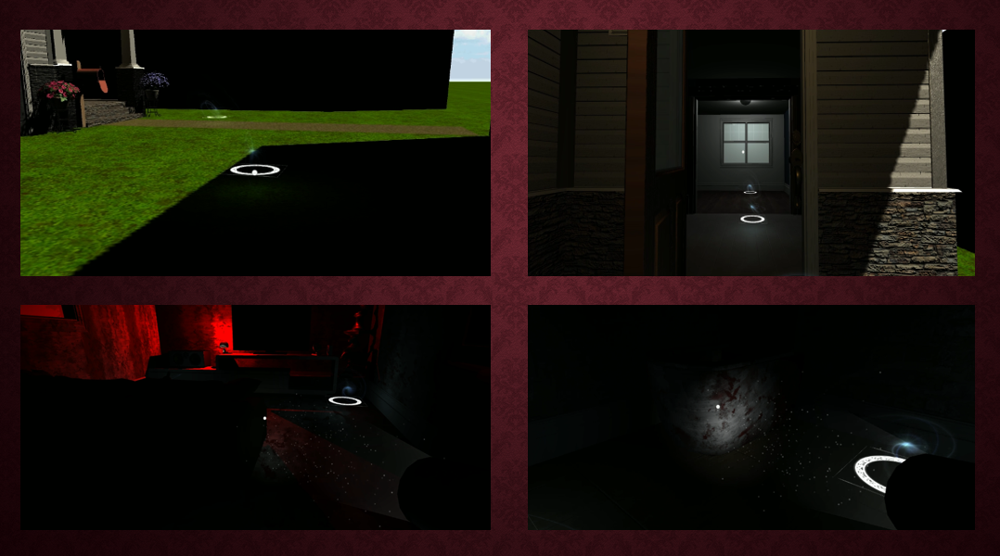

# 소개 



* 이름 : 박한솔 (Park Hansol)
* 전공 : 컴퓨터공학과(빅데이터, 콘텐츠IT)
* Email : hansol732@naver.com
* Github : github.com/bakhanx
* Instagram : B.K___han &#128522;

---

## 경력 및 활동
* 한림대학교 컴퓨터공학과 SW교육/봉사 동아리 'HSV' 회장
* 한림대학교 컴퓨터공학과 창업 동아리 'Stand9' 팀장
* 한림대학교 PC지원실 근로
* 한림대학교 총동문회실 근로
* 한국생산성본부 디지털 종합 역량 서포터즈
* 강원고등학교 아두이노 보조강사
* 방송통신중학교 SW 교육 보조강사
* 강원학생 SW챌린지 대회 STAFF 총괄
* 춘천 LEGO MINDSTORM EV3 교육캠프 보조강사/생활지도강사
* 인제 SW 캠프 2박3일 생활지도강사
* 화천 SW 캠프 2박3일 생활지도강사


# 보유 기술 및 사용 도구


## Language
```
- Java 
- C 
- C++ 
- C# 
- Python 
- R 
- linux
- HTML
- CSS
- JavaScript
- React
- Unity
- Unreal Engine4
- Scratch
- Entry
- EV3
- App Inventor
```

---
# 프로젝트 01


[한림대학교 SW사업단 바로가기](https://https://hlsw.hallym.ac.kr/index.php)

한림대학교 소프트웨어 사업단의 설비나 물자에 대한 대여, 보관 등을 웹과 모바일에서 쉽게 처리 할 수 있도록 사업 진행 중입니다.


## 개발
* Next.js FrameWork 사용
* RaspberryPi, NFC(13.56Hz) 이용

## DevOps
* 사용자 페이지, 관리자 페이지로 개별 구축


# 프로젝트 02
유니티 기반의 VR게임을 제작하였습니다. 장르는 공포/방탈출 이며 이를 PC환경에서 키보드 컨트롤러로 작동 할 수 있도록 하고 추가 컨텐츠 및 그래픽 업데이트 리메이크 계획중입니다.



# 프로젝트 03
동아리별 교류 활성화를 위한 커뮤니티 웹/애플리케이션 기획중입니다.
* 학술동아리 : 정보교류 및 공동구매 도모
* 운동동아리 : 친선경기 매칭 시스템

# 프로젝트 04
건물별 자취 커뮤니티 웹/애플리케이션 기획중입니다.
* 집주인과 입주민들의 소통 공간 (공지사항 전달, 소음문제 해결)
* 부담없는 공동구매 (2인분이상 음식, 배송비절감 대량 생필품구매)